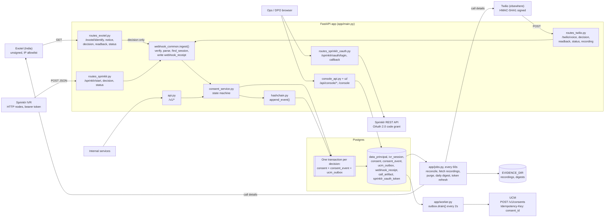
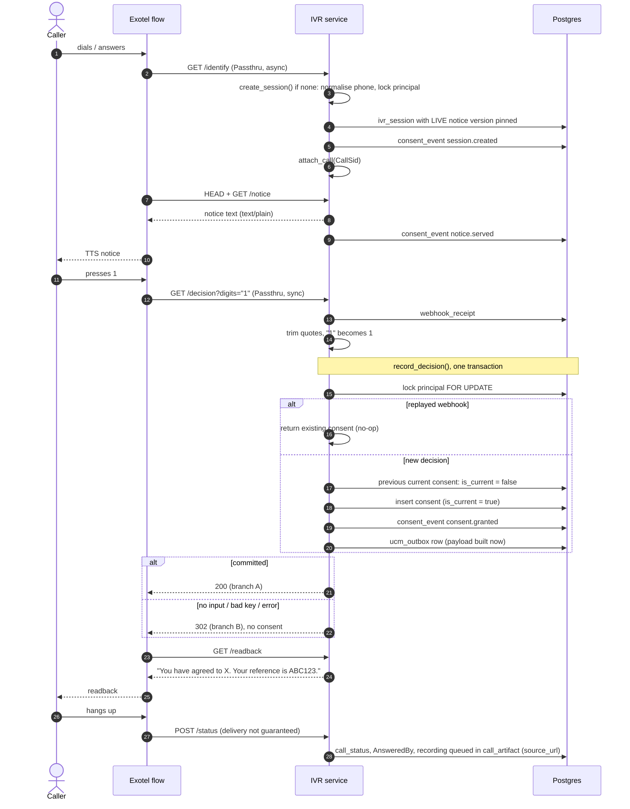
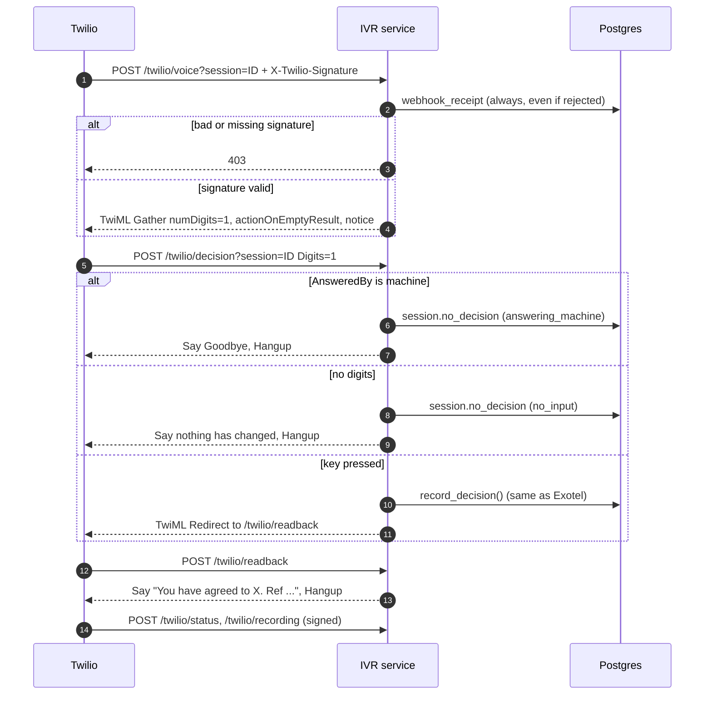
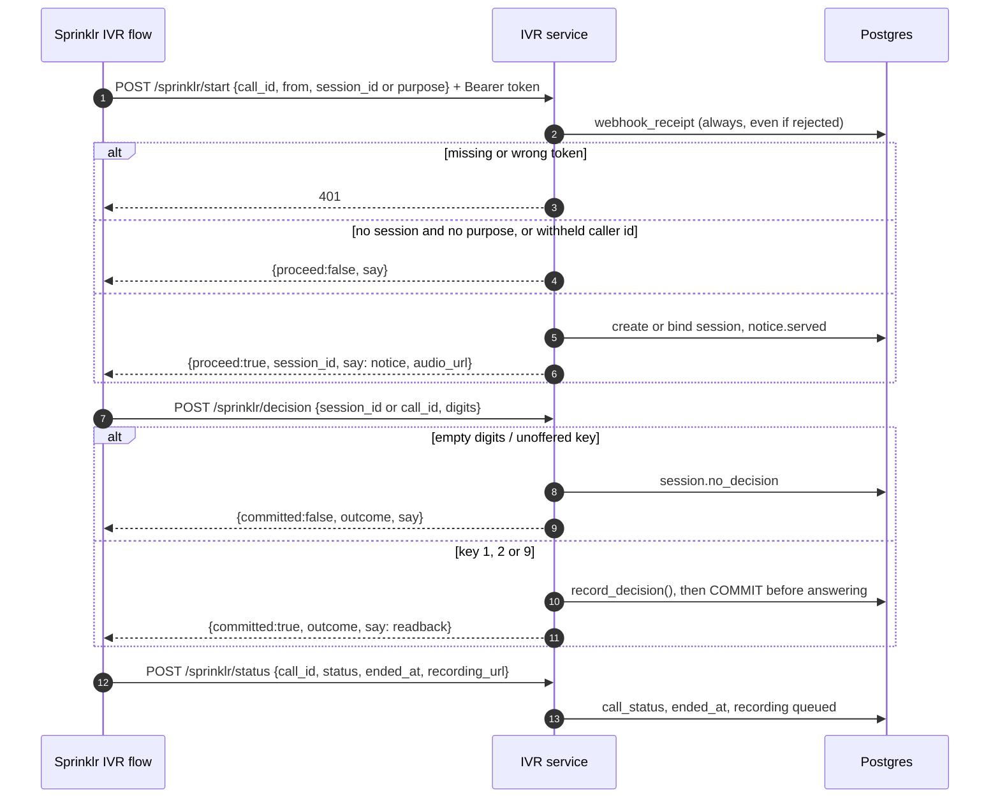
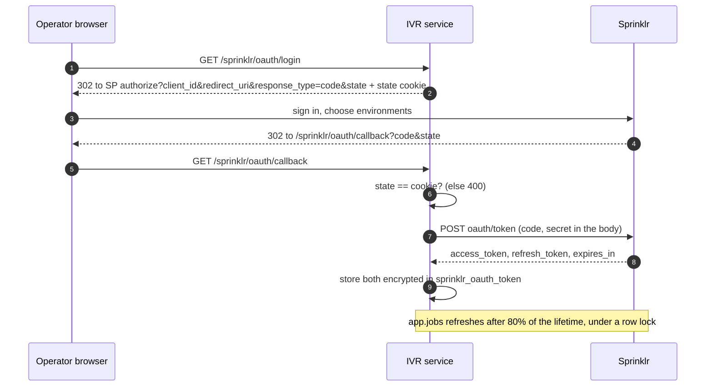
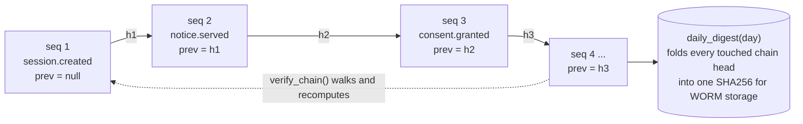
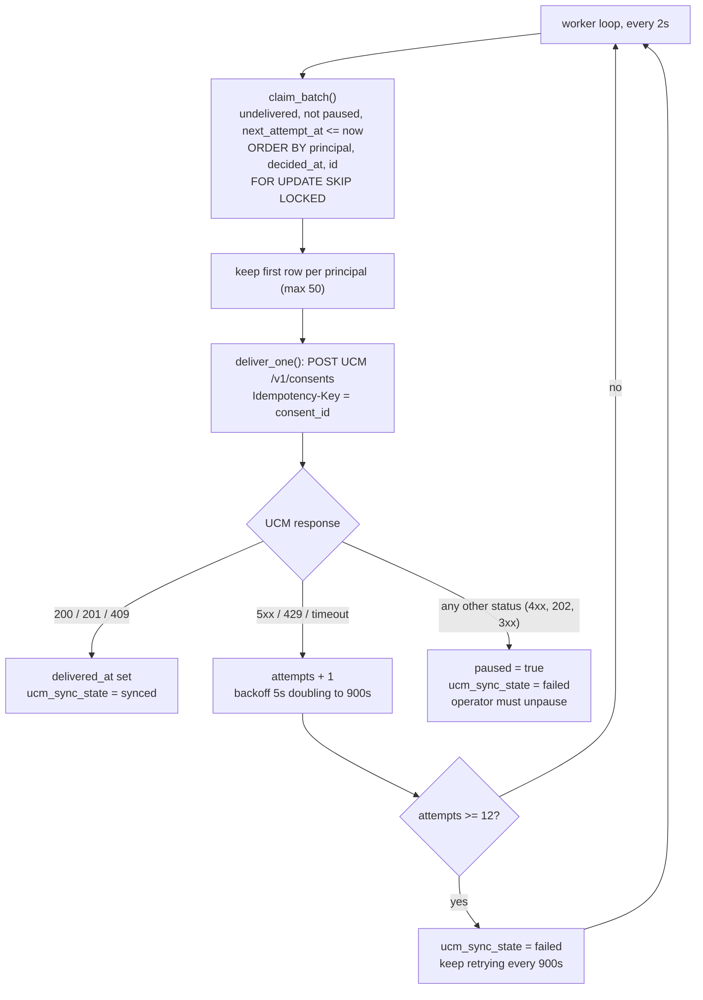

# IVR Consent Capture: architecture and flows

As built on 2026-10-05. A caller hears a versioned DPDP notice,
presses a key, and the decision is stored in Postgres as the write-ahead
record. A separate worker then pushes it to UCM, so a UCM outage can never
lose a consent.

How to run it and integrate it with the ID-PRIVACY® platform (including the
MongoDB port): [id-privacy-integration.md](id-privacy-integration.md).

## Components

| Module | Role |
|---|---|
| `app/routes_exotel.py`, `app/routes_twilio.py` | Provider webhooks; translate call events into consent-service calls |
| `app/telephony/` | Provider-neutral interface: signature verification, parsing, response bodies |
| `app/webhook_common.py` | Rebuild signed URL, verify, write `webhook_receipt`, resolve session |
| `app/consent_service.py` | Consent state machine: sessions, decisions, supersession, outbox row |
| `app/hashchain.py` | Per-principal append-only hash chain |
| `app/outbox.py`, `app/worker.py`, `app/ucm.py` | Ordered, retried delivery to UCM |
| `app/evidence.py`, `app/storage.py` | Recording fetch and purge, evidence bundle, daily chain digest written once to storage |
| `app/routes_sprinklr.py`, `app/telephony/sprinklr.py` | Sprinklr: JSON endpoints for IVR-flow HTTP nodes, shared bearer token |
| `app/routes_sprinklr_oauth.py`, `app/sprinklr_api.py` | Sprinklr REST API: OAuth login and callback, encrypted token store, refresh, API client, call-lookup stub |
| `app/crypto.py` | Phone HMAC, canonical JSON, AES-256-GCM envelope encryption behind `KmsPort` |
| `app/reconcile.py`, `app/jobs.py` | Corroborates finished calls against the provider's call-details API; `python -m app.jobs` runs reconciliation, recording fetch, purge and digest every 60 s |
| `app/api.py` | Service API (`/v1`) |
| `app/console_api.py`, `ui/` | Read-only operator and DPO console |

## Call flow: Exotel (India)

## Call flow: Twilio (outside India)

## Call flow: Sprinklr

Sprinklr's IVR flow plays the audio and collects the key; its HTTP nodes call
JSON endpoints whose contract is ours. The flow branches on response fields.

`committed:true` is only sent after the commit succeeds. FastAPI runs the
request's own commit after the response has left, so every decision endpoint
(Exotel, Twilio, Sprinklr) commits explicitly first.

## Sprinklr REST API (OAuth 2.0)

The other direction: this service calling Sprinklr. URLs are from
dev.sprinklr.com: `https://api3.sprinklr.com/{env}/oauth/authorize|token`,
where `prod` has no `{env}` segment.

Sprinklr allows one token per API key, and each refresh token works once. Two
processes refreshing at the same time would invalidate each other, so the
refresh runs under a row lock; a second deployment needs its own app.

## Evidence jobs

`python -m app.jobs` runs five steps every 60 s, each in its own transaction,
so one failing never stops the others:

| Step | What it does |
|---|---|
| reconcile | For each call older than 5 min, asks the provider's call-details API. Records `call.reconciled` in the chain; on `not_found`, `number_mismatch` or `not_connected`, pauses the consent's undelivered outbox row |
| recordings | Downloads queued recordings into `EVIDENCE_DIR`, hashes them; 12 attempts |
| purge | Deletes recordings past retention, keeping the row and hash |
| digest | Writes yesterday's chain digest once, as a read-only file |
| sprinklr_token | Refreshes the Sprinklr token when due (only with `SPRINKLR_API_ENABLED`) |

## Consent state machine (per principal + purpose)

```mermaid
stateDiagram-v2
    [*] --> NoDecision: call answered

    NoDecision --> Active: key 1 (granted)
    NoDecision --> Declined: key 2 (declined)
    NoDecision --> Withdrawn: key 9 or POST /v1/consents/withdraw
    NoDecision --> [*]: silence, timeout, bad key, machine (no consent row)

    Active --> Superseded: new decision for same purpose
    Declined --> Superseded: new decision for same purpose
    Withdrawn --> Superseded: new decision for same purpose
    Active --> Expired: decided_at + retention_days passes (not implemented yet; status stays active, permits_processing turns false)

    note right of Active
        permits_processing =
        is_current AND status = active
        AND not expired
    end note
    note right of Superseded
        is_current = false, superseded_by = new id.
        Never deleted. DB indexes enforce one current
        consent per purpose and one decision per call.
    end note
```

## Audit hash chain

One chain per data principal (`chain_key = data_principal_id`).
`entry_hash = SHA256(prev_hash || event_type || canonical_json(payload) || UTC ISO occurred_at)`.

Writers hold the principal row lock, so two writers cannot fork the chain. `UNIQUE(chain_key, entry_hash)` backs that up.

## Outbox to UCM

## Why it's built this way

A consent is evidence: months later someone will ask *what exactly did this
person agree to, when, and how do you know?* Each design choice below exists
because the simpler alternative loses that answer.

### The consent is written here first, and delivered to UCM later

**Problem.** If the call handler pushed straight to UCM, a UCM outage or slow
response during a call would either lose the consent or keep the caller
waiting (Exotel's decision Passthru and Twilio's 15-second limit both run
while the caller holds).

**Approach.** The consent row, its audit event and an outbox row commit in one
database transaction (`consent_service.record_decision`). A separate worker
(`app/outbox.py`) delivers to UCM with the consent ID as `Idempotency-Key`, and
retries with backoff for as long as needed.

**Trade-off.** UCM is seconds behind (minutes during an outage), so anyone
reading UCM directly sees a short lag. We monitor `outbox_lag_seconds` for this.

### Decisions are superseded, never edited

**Problem.** Updating a consent row in place erases the grant you relied on
before a withdrawal: exactly what a regulator or a court asks to see.

**Approach.** Every decision is a new row. The previous current row gets
`is_current=false` and `superseded_by`. A partial unique index guarantees one
current consent per person and purpose at every instant.

**Trade-off.** More rows and a two-step swap inside the transaction (clear
the flag, insert, then point), in exchange for a history that can't be lost.

### The notice version is pinned when the call starts

**Problem.** If a notice is republished mid-call, "the notice at decision
time" isn't what the caller heard.

**Approach.** `create_session` pins the live notice version. The consent
stores it, the receipt prints its SHA-256, and published notices are immutable
(a change is a new version).

**Trade-off.** Fixing a typo needs a new version rather than an edit.

### One hash chain per person

**Problem.** An audit log that can be silently rewritten proves nothing. A
single global chain would make every write contend for one lock, and every
verification re-hash the whole system's history.

**Approach.** Each person's events form their own chain
(`entry_hash = SHA256(prev ‖ type ‖ canonical JSON ‖ UTC time)`), written while
that person's row is locked. Verification cost is bounded by one person's
history. Times are hashed in UTC because Postgres renders timestamps in the
connection's time zone; hashing the rendering voided chains read from another
zone (`test_hash_is_timezone_independent`).

**Trade-off.** Chains prove internal consistency only. Tamper-evidence
against someone with database write access needs the daily digest anchored to
write-once storage. `python -m app.jobs` writes each day's digest once, as a
read-only file under `EVIDENCE_DIR/digests/`; a local file is not real WORM
storage ([below](#not-yet-implemented)).

### Silence is never consent, and replays are no-ops

**Problem.** Telephony gives you timeouts, hang-ups, voicemail, wrong keys and
duplicate webhooks. Any of them turned into a grant is a fabricated consent.

**Approach.** Only keys 1, 2 and 9 create a row; everything else records a
session `outcome`. Twilio's `<Gather>` uses `actionOnEmptyResult` so silence is
recorded rather than falling through. A unique index on (session, purpose)
makes a replayed webhook return the original consent.

**Trade-off.** A caller who presses another key on the same call keeps their
first decision; changing it takes a new call.

### Three providers, one state machine

**Problem.** Exotel, Twilio and Sprinklr differ in everything at the edge:
authentication (none, HMAC, bearer token), digit encoding (quoted, plain,
JSON), response format (status codes, TwiML, JSON fields).

**Approach.** `app/telephony/` isolates verification, parsing and responses
per provider. The consent service never sees provider details. Every Twilio request and
Exotel's `/exotel/decision` are stored as a `webhook_receipt` (Exotel's other
endpoints don't write one yet; `/status` is tracked in TODOS.md). For Twilio that includes the
signature, so each consent can be re-verified later.

**Trade-off.** Exotel's unsigned webhooks give a weaker evidence chain. That
is why its routes need an IP allowlist and Call Details corroboration (see the
README's *Two things to know before deploying*). Sprinklr's shared token
authenticates each request, but unlike Twilio's signature it can't be
re-verified afterwards, so it is never stored.

## Not yet implemented

Comments in the code describe these controls, but no code enforces them yet:

- **Corroboration before UCM.** `app/reconcile.py` checks each call against the provider's call-details API, but only after the call ends. A consent can reach UCM first; a mismatch then holds it only if it has not been delivered yet.
- **`/v1` and console authentication.** mTLS and the separate hostnames are expected at deployment; the app itself performs no auth check.
- **WORM storage.** Daily digests and recordings go to the local filesystem (`EVIDENCE_DIR`). Production needs S3 in `ap-south-1` with Object Lock behind `app/storage.py`.
- **Cloud KMS.** Attribute encryption is AES-256-GCM envelope encryption, but the key-encryption key comes from `ATTRIBUTE_KEY` through `LocalKms`. Production needs a KMS client behind `crypto.KmsPort`.
- **Append-only audit tables.** The database doesn't enforce append-only on `consent_event` and `webhook_receipt`.
- **Sprinklr call lookup.** `sprinklr_api.fetch_call_details` is a stub until Sprinklr names a call-details endpoint, so Sprinklr calls are never reconciled. Open questions are marked `TODO(sprinklr)` in the code and listed in TODOS.md.
- **Outbox ordering under retries.** `claim_batch` filters out rows that aren't due before it picks each principal's oldest row. So a grant waiting to retry can be overtaken by a later withdrawal.
