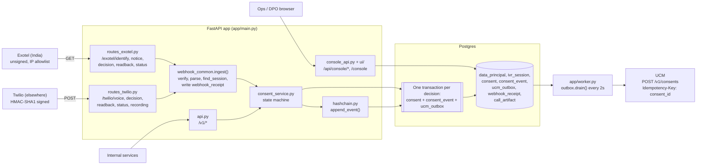
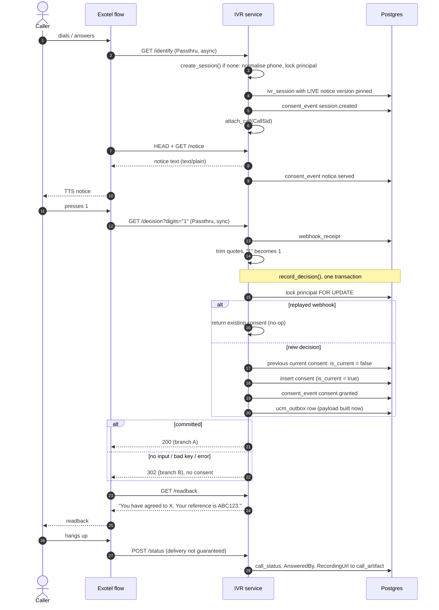
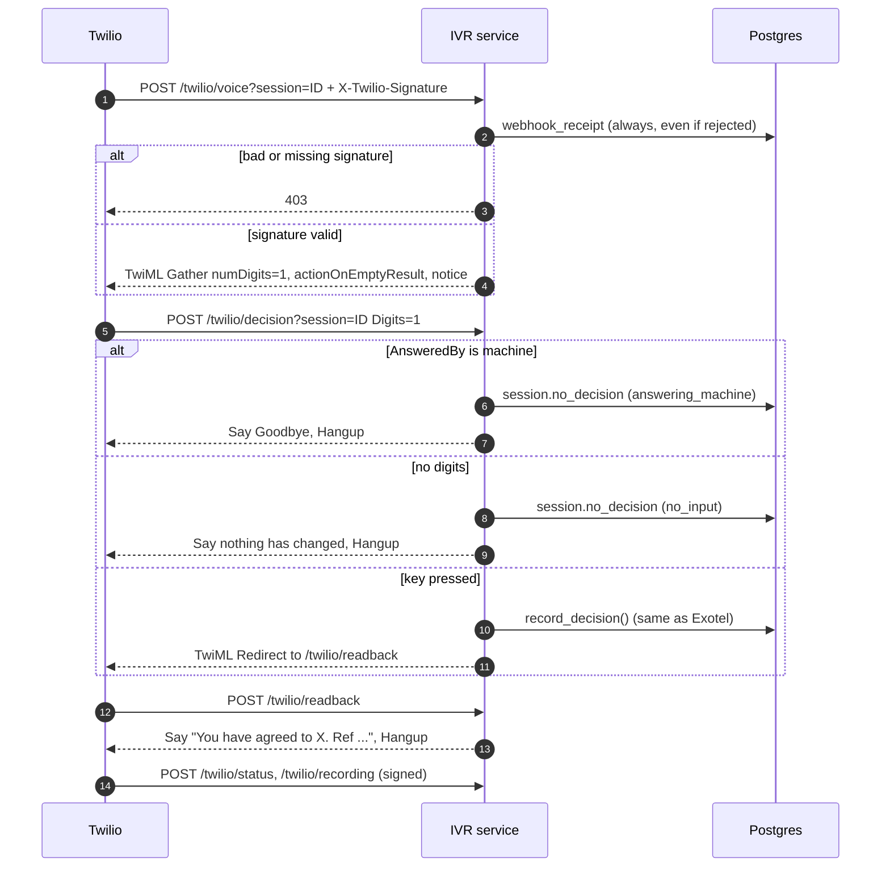
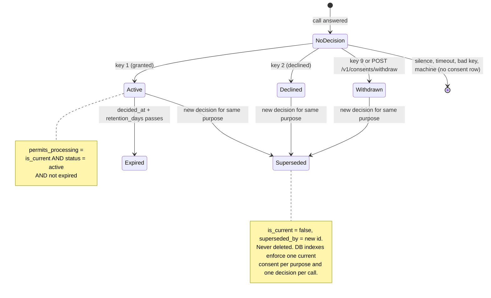
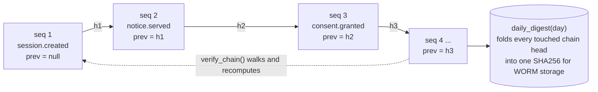
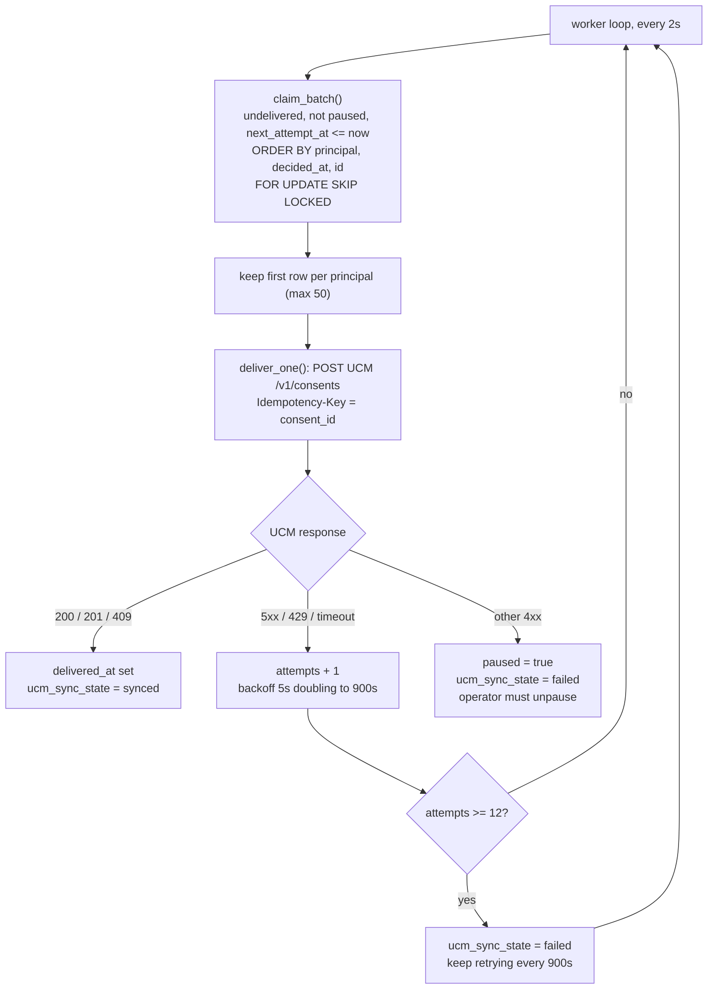

# IVR Consent Capture: architecture and flows

As built at `a19b1e6` (2026-10-01). A caller hears a versioned DPDP notice,
presses a key, and the decision is stored in Postgres as the write-ahead
record. A separate worker then pushes it to UCM, so a UCM outage can never
lose a consent.

How to run it and integrate it with the ID-PRIVACY® platform (including the
MongoDB port): [id-privacy-integration.md](id-privacy-integration.md).

## Components

| Module | Role |
|---|---|
| `app/routes_exotel.py`, `app/routes_twilio.py` | Provider webhooks; translate call events into consent-service calls |
| `app/telephony/` | Provider-neutral interface: signature verification, parsing, response bodies |
| `app/webhook_common.py` | Rebuild signed URL, verify, write `webhook_receipt`, resolve session |
| `app/consent_service.py` | Consent state machine: sessions, decisions, supersession, outbox row |
| `app/hashchain.py` | Per-principal append-only hash chain |
| `app/outbox.py`, `app/worker.py`, `app/ucm.py` | Ordered, retried delivery to UCM |
| `app/evidence.py` | Recording artifacts, evidence bundle, daily chain digest |
| `app/api.py` | Service API (`/v1`) |
| `app/console_api.py`, `ui/` | Read-only operator and DPO console |

## Call flow: Exotel (India)

## Call flow: Twilio (outside India)

## Consent state machine (per principal + purpose)

## Audit hash chain

One chain per data principal (`chain_key = data_principal_id`).
`entry_hash = SHA256(prev_hash || event_type || canonical_json(payload) || UTC ISO occurred_at)`.

Writers hold the principal row lock, so two writers cannot fork the chain. `UNIQUE(chain_key, entry_hash)` backs that up.

## Outbox to UCM

## Why it's built this way

A consent is evidence: months later someone will ask *what exactly did this
person agree to, when, and how do you know?* Each design choice below exists
because the simpler alternative loses that answer.

### The consent is written here first, and delivered to UCM later

**Problem.** If the call handler pushed straight to UCM, a UCM outage or slow
response during a call would either lose the consent or keep the caller
waiting (Exotel's decision Passthru and Twilio's 15-second limit both run
while the caller holds).

**Approach.** The consent row, its audit event and an outbox row commit in one
database transaction (`consent_service.record_decision`). A separate worker
(`app/outbox.py`) delivers to UCM with the consent ID as `Idempotency-Key`, and
retries with backoff for as long as needed.

**Trade-off.** UCM is seconds behind (minutes during an outage), so anyone
reading UCM directly sees a short lag. We monitor `outbox_lag_seconds` for this.

### Decisions are superseded, never edited

**Problem.** Updating a consent row in place erases the grant you relied on
before a withdrawal: exactly what a regulator or a court asks to see.

**Approach.** Every decision is a new row. The previous current row gets
`is_current=false` and `superseded_by`. A partial unique index guarantees one
current consent per person and purpose at every instant.

**Trade-off.** More rows and a two-step swap inside the transaction (clear
the flag, insert, then point), in exchange for a history that can't be lost.

### The notice version is pinned when the call starts

**Problem.** If a notice is republished mid-call, "the notice at decision
time" isn't what the caller heard.

**Approach.** `create_session` pins the live notice version. The consent
stores it, the receipt prints its SHA-256, and published notices are immutable
(a change is a new version).

**Trade-off.** Fixing a typo needs a new version rather than an edit.

### One hash chain per person

**Problem.** An audit log that can be silently rewritten proves nothing. A
single global chain would make every write contend for one lock, and every
verification re-hash the whole system's history.

**Approach.** Each person's events form their own chain
(`entry_hash = SHA256(prev ‖ type ‖ canonical JSON ‖ UTC time)`), written while
that person's row is locked. Verification cost is bounded by one person's
history. Times are hashed in UTC because Postgres renders timestamps in the
connection's time zone; hashing the rendering voided chains read from another
zone (`test_hash_is_timezone_independent`).

**Trade-off.** Chains prove internal consistency only. Tamper-evidence
against someone with database write access needs the daily digest anchored to
write-once storage, which is not running yet ([below](#not-yet-implemented)).

### Silence is never consent, and replays are no-ops

**Problem.** Telephony gives you timeouts, hang-ups, voicemail, wrong keys and
duplicate webhooks. Any of them turned into a grant is a fabricated consent.

**Approach.** Only keys 1, 2 and 9 create a row; everything else records a
session `outcome`. Twilio's `<Gather>` uses `actionOnEmptyResult` so silence is
recorded rather than falling through. A unique index on (session, purpose)
makes a replayed webhook return the original consent.

**Trade-off.** A caller who presses another key on the same call keeps their
first decision; changing it takes a new call.

### Two providers, one state machine

**Problem.** Exotel and Twilio differ in everything at the edge: signing
(none vs HMAC), digit encoding (quoted vs plain), response format (status
codes vs TwiML).

**Approach.** `app/telephony/` isolates verification, parsing and responses
per provider. The consent service never sees provider details, and every
inbound request is stored as a `webhook_receipt`. For Twilio that includes the
signature, so each consent can be re-verified later.

**Trade-off.** Exotel's unsigned webhooks give a weaker evidence chain. That
is why its routes need an IP allowlist and Call Details corroboration (see the
README's *Two things to know before deploying*).

## Not yet implemented

Comments in the code describe these controls, but no code enforces them yet:

- **Exotel corroboration.** Nothing checks an Exotel consent against the Call Details API before it goes to UCM. The only protection today is the IP allowlist at the edge.
- **`/v1` and console authentication.** mTLS and the separate hostnames are expected at deployment; the app itself performs no auth check.
- **Daily digest anchoring.** `daily_digest()` exists, but nothing schedules it or writes the result to WORM storage.
- **Append-only audit tables.** The database doesn't enforce append-only on `consent_event` and `webhook_receipt`.
- **Outbox ordering under retries.** `claim_batch` filters out rows that aren't due before it picks each principal's oldest row. So a grant waiting to retry can be overtaken by a later withdrawal.
