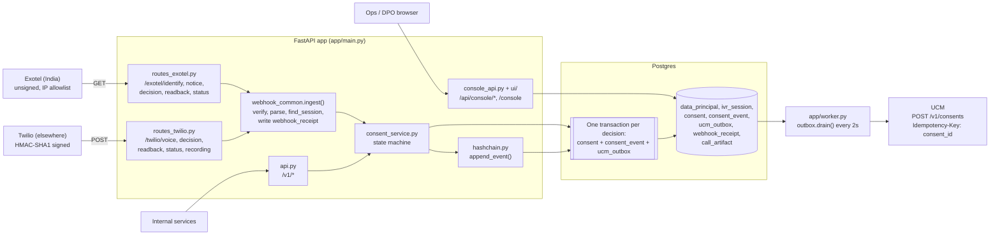
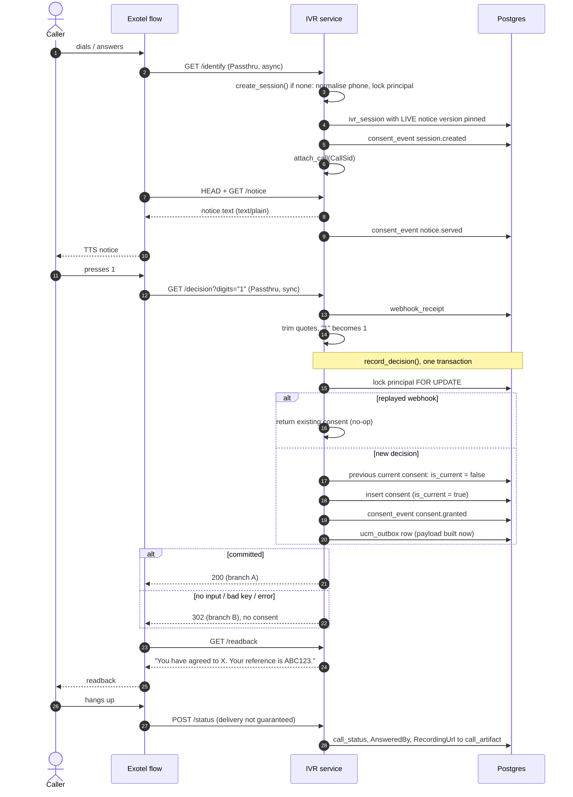
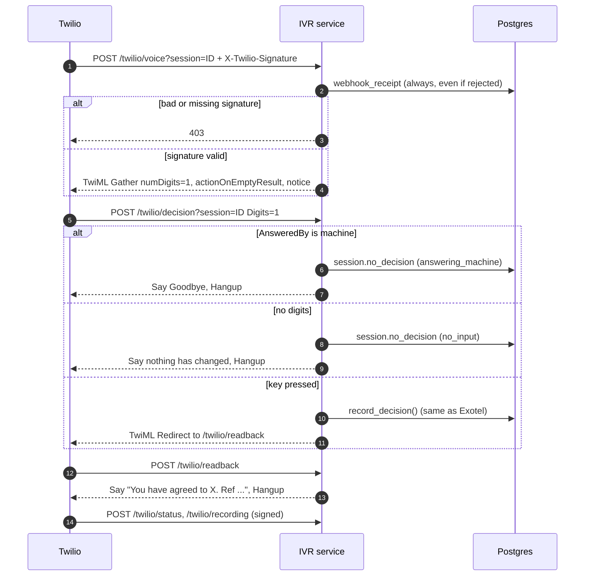
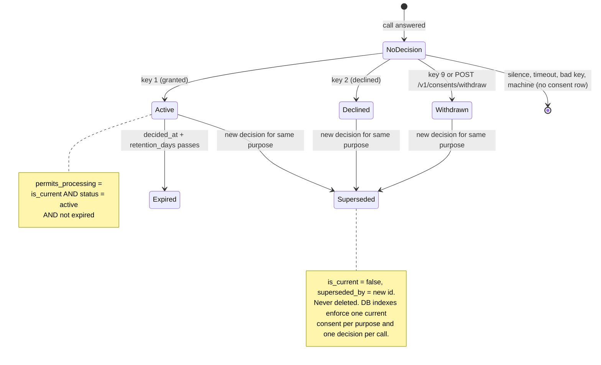
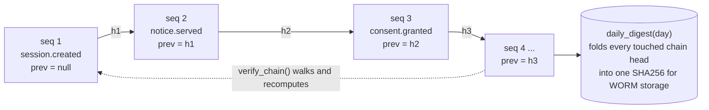
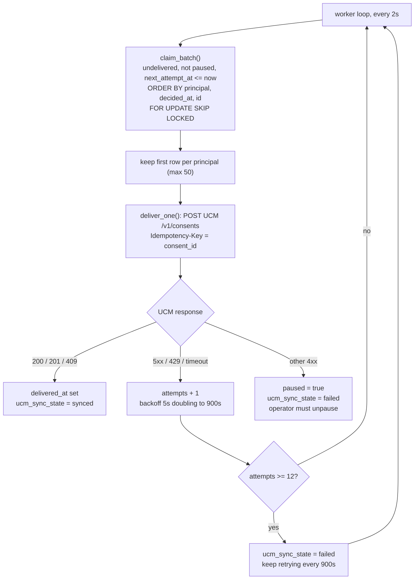

# IVR Consent Capture: architecture and flows

As built at `a19b1e6` (2026-10-01). A caller hears a versioned DPDP notice,
presses a key, and the decision is stored in Postgres as the write-ahead
record. A separate worker then pushes it to UCM, so a UCM outage can never
lose a consent.

## Components

| Module | Role |
|---|---|
| `app/routes_exotel.py`, `app/routes_twilio.py` | Provider webhooks; translate call events into consent-service calls |
| `app/telephony/` | Provider-neutral interface: signature verification, parsing, response bodies |
| `app/webhook_common.py` | Rebuild signed URL, verify, write `webhook_receipt`, resolve session |
| `app/consent_service.py` | Consent state machine: sessions, decisions, supersession, outbox row |
| `app/hashchain.py` | Per-principal append-only hash chain |
| `app/outbox.py`, `app/worker.py`, `app/ucm.py` | Ordered, retried delivery to UCM |
| `app/evidence.py` | Recording artifacts, evidence bundle, daily chain digest |
| `app/api.py` | Service API (`/v1`) |
| `app/console_api.py`, `ui/` | Read-only operator and DPO console |

## Call flow: Exotel (India)

## Call flow: Twilio (outside India)

## Consent state machine (per principal + purpose)

## Audit hash chain

One chain per data principal (`chain_key = data_principal_id`).
`entry_hash = SHA256(prev_hash || event_type || canonical_json(payload) || UTC ISO occurred_at)`.

Writers hold the principal row lock, so two writers cannot fork the chain. `UNIQUE(chain_key, entry_hash)` backs that up.

## Outbox to UCM

## Not yet implemented

Comments in the code describe these controls, but no code enforces them yet:

- **Exotel corroboration.** Nothing checks an Exotel consent against the Call Details API before it goes to UCM. The only protection today is the IP allowlist at the edge.
- **`/v1` and console authentication.** mTLS and the separate hostnames are expected at deployment; the app itself performs no auth check.
- **Daily digest anchoring.** `daily_digest()` exists, but nothing schedules it or writes the result to WORM storage.
- **Append-only audit tables.** The database doesn't enforce append-only on `consent_event` and `webhook_receipt`.
- **Outbox ordering under retries.** `claim_batch` filters out rows that aren't due before it picks each principal's oldest row. So a grant waiting to retry can be overtaken by a later withdrawal.
