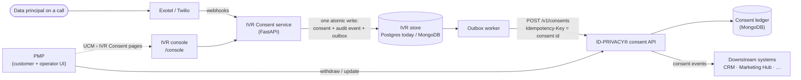
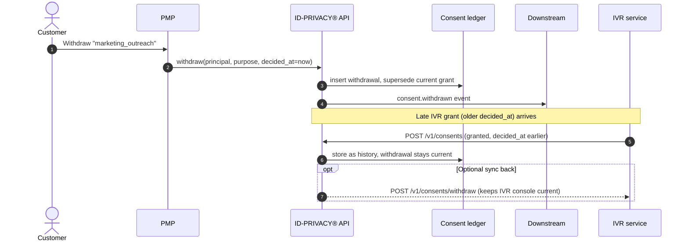

# IVR Consent Capture in the ID-PRIVACY® platform

How the service works, how to run and use it, and how to integrate it with the
ID-PRIVACY® platform (PMP, the consent ledger, downstream delivery), including
the move from PostgreSQL to MongoDB.

Detailed internal diagrams (call flows, state machine, hash chain, outbox) are
in [architecture.md](architecture.md). This document is the operator and
integrator view.

> **Assumptions to confirm.** Sections 4 and 5 assume:
> (a) the "UCM" this service pushes to is the ID-PRIVACY® consent API;
> (b) ID-PRIVACY® is the source of truth for current consent state, and this service is a capture channel;
> (c) MongoDB is the store for both. If any of these is wrong, section 4 changes; section 5 does not.

---

## 1. What it is

A voice channel for DPDP consent. A person hears a versioned notice on a phone
call, presses a key, and the decision becomes a consent record with
call-level evidence, then flows into ID-PRIVACY® like a consent from any
other channel.

| Key | Decision | Stored as |
|---|---|---|
| 1 | Grant | `granted` / `active`, expires after the purpose's retention period |
| 2 | Decline | `declined` |
| 9 | Withdraw | `withdrawn` |
| Silence, wrong key, voicemail, withheld caller ID | none | No consent. The call outcome is recorded |

Two telephony providers sit behind one interface:

| | Exotel (India) | Twilio (outside India) |
|---|---|---|
| Webhook authenticity | Unsigned: IP allowlist + Call Details corroboration (corroboration not built yet, see §7) | HMAC-SHA1 signature on every request, stored for re-verification |
| Numbers | Indian local and mobile | US/intl; India toll-free only |
| Residency | Mumbai cluster (`api.in.exotel.com`) | No India region |

---

## 2. How it works



1. **Session.** An outbound campaign creates a session through `POST /v1/sessions`; inbound calls create one on arrival. The live notice version is pinned at that moment, so the record always shows exactly which wording the caller heard.
2. **Notice.** The provider reads the notice by text-to-speech, or plays recorded audio. A `notice.served` event is written.
3. **Decision.** The keypress arrives as a webhook. In **one transaction** the service writes the consent row, appends an event to the person's hash chain, and queues an outbox row. Either all three are saved or none are.
4. **Readback.** The caller hears "You have agreed to X. Your reference is ABC123."
5. **Delivery.** The worker sends the outbox row to ID-PRIVACY® with the consent ID as an idempotency key, retrying with backoff until it's accepted. A UCM outage never loses a consent.
6. **Evidence.** For each consent the service keeps:
   - the webhook receipts (with Twilio signatures);
   - the notice hash;
   - the recording reference and hash;
   - the per-person hash chain, verifiable with `GET /v1/consents/{id}/evidence`.

A consent is never edited. A new decision supersedes the previous one (`is_current=false`, `superseded_by`), so the history of what was relied on and when stays intact.

---

## 3. How to use it

### Run it

```bash
pip install -r requirements.txt
export DATABASE_URL=postgresql+psycopg2://user@localhost/ivr_consent   # Postgres today
python -c "from app.db import apply_migrations; apply_migrations()"
cd ui && npm install && npm run build && cd ..
uvicorn app.main:app --port 8088        # API + webhooks + console at /console
python -m app.worker                    # outbox → ID-PRIVACY®
```

Configuration is in `.env.example`. No secret has a default except the two placeholder keys flagged in §7.

| Variable | Purpose |
|---|---|
| `UCM_BASE_URL` | ID-PRIVACY® consent API base URL |
| `PUBLIC_BASE_URL` | Public HTTPS origin; must equal the URL Twilio calls, or every signature fails |
| `TWILIO_ACCOUNT_SID`, `TWILIO_AUTH_TOKEN`, `TWILIO_CALLER_ID` | Twilio live credentials (primary auth token, not an API key) |
| `EXOTEL_*` | Exotel account and Mumbai base URL |
| `PHONE_HMAC_KEY`, `ATTRIBUTE_KEY` | Phone lookup hash and PII encryption keys (KMS in production) |

### Configure a purpose and notice

A **purpose** (`code`, `name`, `retention_days`, `requires_verification`, and `ucm_purpose_key`, its ID-PRIVACY® purpose ID) has one or more **notice versions** per language (`body_text`, optional `audio_url`, `published_at`). Published notices are immutable. A wording change is a new version. List them with `GET /v1/purposes`.

### Capture consent

| Flow | How |
|---|---|
| **Inbound (Twilio)** | Number's "A call comes in" webhook → `POST https://<host>/twilio/voice?purpose=<code>` |
| **Inbound (Exotel)** | Exotel flow: Passthru `/exotel/identify?purpose=<code>` → Greeting `/exotel/notice` → Passthru `/exotel/decision` → Greeting `/exotel/readback`; StatusCallback `/exotel/status` |
| **Outbound** | `POST /v1/sessions {"direction":"ivr_outbound","phone_e164","purpose_key","provider"}` → place the call with `place_call_twilio()` / `place_call_exotel()` passing `session_id` (no caller wired yet, see §7) |

### Read and operate

| Endpoint | Use |
|---|---|
| `GET /v1/consents?phone_e164=…` | Current consent per purpose, `permits_processing`, sync state |
| `GET /v1/consents/{id}/evidence` | Full evidence bundle and chain verification |
| `POST /v1/consents/withdraw?phone_e164=…` | Out-of-call withdrawal (see §4.3) |
| `/console` | Operator console: overview, consents (phones masked in lists), calls, purposes, printable DPDP receipt |
| `GET /readyz` | Liveness plus outbox lag (alert on `outbox_lag_seconds`) |

---

## 4. Integrating with ID-PRIVACY®

### 4.1 Role of each system

| System | Owns |
|---|---|
| **IVR Consent service** | Call capture, notice delivery proof, webhook receipts, per-call evidence, delivery into ID-PRIVACY® |
| **ID-PRIVACY® consent API + ledger** | The current consent state per person and purpose, from every channel. **Source of truth for "may we process?"** |
| **PMP** | Customer self-service (view, withdraw) and operator UI; hosts the IVR console pages under UCM › IVR Consent |
| **Downstream systems** | Receive consent events from ID-PRIVACY® only, never from the IVR service directly |

### 4.2 IVR → ID-PRIVACY® contract

The worker sends one request per decision:

```http
POST {UCM_BASE_URL}/v1/consents
Idempotency-Key: 01M3YF6CX04GXYRAPMY22RF4MB
Content-Type: application/json

{
  "source": "ivr",
  "external_consent_id": "01M3YF6CX04GXYRAPMY22RF4MB",
  "data_principal": {"phone_e164": "+19735552582", "external_ref": "…", "name": "…", "email": "…"},
  "purpose_key": "marketing_outreach",
  "decision": "granted",
  "decided_at": "2026-10-02T14:09:52+00:00",
  "channel": "ivr_inbound",
  "provider": "twilio",
  "language": "eng",
  "notice": {"version_id": "01M3…", "sha256": "5321ced7…"},
  "verification_level": "ani_only",
  "evidence": {"call_sid": "CA24a4…"}
}
```

The ID-PRIVACY® side must:

| Requirement | Why |
|---|---|
| Treat `Idempotency-Key` as unique; return `200`/`201` on first write and `409` (or the original `201`) on a repeat | The worker retries; duplicates must not create two consents |
| Return `{"consent_ref": "…"}` | Shown in the IVR console and evidence |
| **Order by `decided_at`, not by arrival** | An IVR grant can arrive minutes late (retry, Exotel corroboration hold). If a PMP withdrawal for the same person and purpose has a later `decided_at`, the withdrawal must stay current |
| Return `4xx` (not `429`) only for a genuinely bad payload | `4xx` pauses that row for an operator; `5xx`/`429`/timeouts retry with backoff |
| Map `purpose_key` to the ledger's purpose | Set `purpose.ucm_purpose_key` to the ID-PRIVACY® purpose ID |
| (Planned) accept an evidence update for an existing `external_consent_id` | Recording URI and hash arrive after hang-up (eng-review task T4) |

### 4.3 Withdrawals made in PMP



- The **ledger** decides what is current, using `decided_at`. The IVR service never pushes to downstream systems.
- The IVR database does not learn about PMP withdrawals unless ID-PRIVACY® calls back. Until then, `GET /v1/consents` on the IVR service can be stale. **Downstream systems and PMP must ask ID-PRIVACY®, never the IVR service, whether processing is allowed.**
- Withdrawing *by phone* (key 9) flows IVR → ID-PRIVACY® like any other decision.

### 4.4 Console inside PMP

The console already uses the PMP navigation (UCM › IVR Consent) and header. Two ways to ship it:

| Option | How | Notes |
|---|---|---|
| **Link out** (simplest) | PMP's UCM menu links to `https://<ivr-host>/console/...` | Separate origin; needs SSO at the IVR host |
| **Same origin** (recommended) | PMP's gateway routes `/ivr/console/*` and `/ivr/api/console/*` to this service | One login and one look; set Vite `base` to `/ivr/console/` |

Authentication: the console and `/v1` currently have **no auth in code** (eng-review task T3). The planned design is a fail-closed check that trusts identity headers set by the PMP gateway (SSO user or mTLS subject plus a shared proxy secret). That identity drives the avatar and roles.

### 4.5 Deployment shape

- **Webhook ingress:** a separate hostname per provider. `/exotel/*` behind the Exotel IP allowlist; `/twilio/*` public HTTPS (signatures authenticate it). `PUBLIC_BASE_URL` = that exact HTTPS origin.
- **Service API and console:** internal hostname behind the PMP gateway.
- **Worker:** one process per deployment until eng-review task T1 lands (it makes multiple workers safe).
- **Region:** Exotel Mumbai plus storage in `ap-south-1` for India; recordings copied out of the provider into our bucket.

---

## 5. Moving from PostgreSQL to MongoDB

The application logic (state machine, hash chain, provider handling, payload) does not change. What changes is how five database guarantees are expressed. **All five must hold in MongoDB, or consents can be lost, duplicated or contradictory.**

### 5.1 Collections

| Postgres table | MongoDB collection | `_id` |
|---|---|---|
| `data_principal` | `data_principals` | ULID string |
| `identity_attribute` | `identity_attributes` | ULID |
| `purpose`, `notice_version` | `purposes`, `notice_versions` | ULID |
| `ivr_session` | `ivr_sessions` | ULID |
| `consent` | `consents` | ULID (= `external_consent_id`) |
| `consent_event` | `consent_events` | `{chain_key, seq}` compound or ULID + unique index |
| `ucm_outbox` | `ucm_outbox` | ULID |
| `webhook_receipt`, `call_artifact` | `webhook_receipts`, `call_artifacts` | ULID |

Alternative: write `consents` straight into the ID-PRIVACY® ledger's collection. That couples the two schemas and removes the outbox's protection against ledger outages, so keep separate collections even if they're in the same cluster.

### 5.2 The five guarantees and their MongoDB form

| # | Guarantee | Postgres today | MongoDB |
|---|---|---|---|
| 1 | Consent + audit event + outbox commit together | One SQL transaction | **Multi-document transaction** (`session.with_transaction`). Requires a **replica set** (MongoDB ≥ 4.0; sharded ≥ 4.2), and `writeConcern: majority`. Retry on `TransientTransactionError` |
| 2 | One current consent per person + purpose | Partial unique index `WHERE is_current` | `createIndex({data_principal_id:1, purpose_id:1}, {unique:true, partialFilterExpression:{is_current:true}})` |
| 3 | One decision per call (webhook replay is a no-op) | Partial unique index on `(ivr_session_id, purpose_id)` | Same, `partialFilterExpression:{ivr_session_id:{$type:"string"}}` |
| 4 | Writers for one person are serialised, so the hash chain can't fork | `SELECT … FOR UPDATE` on the principal | No row locks. Inside the transaction, update the principal doc **conditionally**: `updateOne({_id, chain_head: <expected>}, {$set:{chain_head:<new>}, $inc:{chain_seq:1}})`. A concurrent writer gets a write conflict and the transaction retries. Back it with a unique index `{chain_key:1, seq:1}` on `consent_events` |
| 5 | Outbox delivers each person's decisions in order, safely across workers | `FOR UPDATE SKIP LOCKED` | Assign `outbox_seq` from the principal doc in the same transaction. The worker claims with `findOneAndUpdate({data_principal_id, delivered_at:null, lease_until:{$lt:now}}, {$set:{lease_until:now+30s, lease_owner:me}}, {sort:{outbox_seq:1}})` and **delivers a person's row only if it is their lowest undelivered `outbox_seq`** (this also fixes eng-review T1) |

### 5.3 MongoDB-specific pitfalls

- **Timestamp precision breaks the hash chain.**
  - BSON dates keep **milliseconds**; Python datetimes and Postgres keep microseconds.
  - If an event's hash is computed with microseconds and the stored value is truncated, every chain fails verification on read.
  - Fix: truncate `occurred_at` to milliseconds *before* hashing (`ts.replace(microsecond=ts.microsecond // 1000 * 1000)`), or hash and store an ISO-8601 string.
  - Keep `canonical_instant()` as UTC.
- **JSON canonicalisation.** `canonical_json` sorts keys, so BSON key order is harmless. Store payload numbers as integers/strings, never floats.
- **Append-only, enforced.** Give the app a custom role with only `find` and `insert` on `consent_events` and `webhook_receipts`. Without `update`/`remove`, the audit trail can't be rewritten through the app's credentials. This is easier to enforce than in Postgres.
- **Daily anchor.** A change stream or a daily job over `consent_events` produces the per-day digest for WORM (write-once) storage (eng-review T5).
- **Connection pool.** Size `maxPoolSize` at least as large as concurrent handler threads, with a short `waitQueueTimeoutMS`. The Postgres build locked up under load at about 100 concurrent calls for exactly this reason (see `.gstack/benchmark-reports/2026-10-01-load-benchmark.md`).

### 5.4 Code changes for the port

| Area | Change |
|---|---|
| `app/db.py`, `app/models.py`, `migrations/*.sql` | Replace SQLAlchemy engine and models with a `pymongo` (or `motor`) client, collection handles and an index bootstrap script |
| `consent_service.py`, `hashchain.py`, `outbox.py`, `identity.py`, `evidence.py`, `ucm.py` | Port about 130 queries; wrap `record_decision` in `with_transaction`; principal compare-and-set for the chain head; leased outbox claims |
| `api.py`, `console_api.py`, `webhook_common.py`, `routes_*.py` | Swap the `Session` dependency for a repository object; console aggregations as `$match`/`$group` pipelines |
| `tests/conftest.py` | Throwaway `mongo` replica-set container instead of Postgres |
| Unchanged | Provider adapters, signature verification, TwiML/Exotel responses, payload shape, console UI |

Suggested order:
1. Introduce a repository interface over the current SQLAlchemy code, with no behaviour change (the 85 existing tests are the safety net).
2. Implement the MongoDB repository behind it.
3. Run the same test suite against both.
4. Cut over.

Estimate: about 2–3 weeks for a human team, or 1–2 days with Claude Code, plus a re-run of the load test.

---

## 6. Go-live checklist

- [ ] Assumptions (a)–(c) at the top confirmed with the ID-PRIVACY® team
- [ ] ID-PRIVACY® consent API implements the §4.2 contract, especially ordering by `decided_at`
- [ ] Purposes created with `ucm_purpose_key` = ID-PRIVACY® purpose IDs; notices published per language
- [ ] MongoDB replica set, indexes from §5.2, app role from §5.3
- [ ] Webhook hostnames, Exotel IP allowlist, Twilio number webhook pointed at `PUBLIC_BASE_URL`
- [ ] Console behind the PMP gateway with SSO (T3)
- [ ] `PHONE_HMAC_KEY` / `ATTRIBUTE_KEY` from KMS; placeholder encryption replaced
- [ ] Load test re-run after the pool fixes; `outbox_lag_seconds` alert wired

## 7. Known gaps (from the 2026-10-01 eng review, CSO audit and QA)

| ID | Gap | Impact |
|---|---|---|
| T1 | Outbox can deliver a person's decisions out of order | A withdrawal can reach ID-PRIVACY® before the grant it cancels (§5.2 #5 fixes it in the Mongo port) |
| T2 | Exotel consents not corroborated against Call Details API | Forged unsigned requests can create consents |
| T3 | No auth on `/v1` and console | Must sit behind the PMP gateway until fixed |
| T4 | Recording evidence never sent to ID-PRIVACY® | Evidence split across systems |
| T5–T6 | Daily anchor not scheduled; audit tables not append-only in Postgres | Tamper-evidence incomplete (§5.3 covers Mongo) |
| T7–T8 | Write-failure path; out-of-call withdrawal channel | See the eng review report |
| Load | Pool/thread lockup at ~100 concurrent calls; UCM delivery ~20/s | Size pools; parallelise the worker per person |
| Outbound | `place_call_*` has no API caller | Campaign dialler or endpoint needed |
